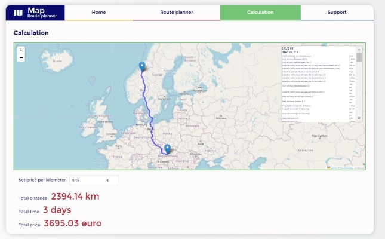

# Calculator of worstation price

&nbsp;

## Table of contents

[⭐ Overview](#⭐-overview)
  - [Instalation](#Installation-💿)
  - [Links](#links)

[💡 My process](#💡-my-process)
  - [Technologies](#Technologies)
  - [Solutions provided in the project](#Solutions-provided-in-the-project)

  - [Useful resources](#useful-resources)

[Screenshot](#screenshot)

[🙋‍♂️ Author](#🙋‍♂️-author)


&nbsp;

## ⭐ Overview

&nbsp;

### **Installation 💿**

The project uses [node](https://nodejs.org/en/), [npm](https://www.npmjs.com/), [CRA](https://create-react-app.dev/) and [whatwg-fetch](https://github.com/github/fetch).

Having them installed, type into the terminal: 
```
npm i
```
Then, you may run webpack typing in the terminal:

```
npm start
```

App is available using the following addresses:

http://localhost:3000

&nbsp;

### **Links:**
- [GitHub](https://github.com/kowackag/road-map)

&nbsp;

### **Technologies:**


&nbsp;
  
### **Solutions provided in the project:**
- HTML:
    - The project was built using semantic HTML5 markup.
- CSS:
    - The css styles are created using `styled-components`.
    - The `Custom Checkbox` and `Dropdown` was created.
    
- JS:
    - ES2015+ (arrow functions, destructuring, spread operator) was used.
    - To store all communication with the API in one place, the function DataAPI was created (in the separated file `DataAPI.js`).
    - Communication with API is based on `fetch()` method.
    - To run the project using browsers that do not support `fetch()` method, package `whatwg-fetch` was used.
    - All fields are validated .
- React:
    - The following hooks were used: `useState`, `useEffect`, `useRef`, `useContext` and `Custom Hook`.
    - Components are split and kept in smaller ones.
    - `Font Awesome` ikons was used in  React app thanks to `@fortawesome/react-fontawesome`.
    - I used from `react-to-print` to add possibility to print effects of application.


I had opted to use `styled-components` as a solution for managing the CSS.

To make coding with `styled-component` more comfortable, I used a special Extension in Visual Studio Code `vscode-styled-components`.

I used the `createGlobalStyle` function from styled-components and added reset style and some global styles (`Reset.js` and `Global.js`)

Data during working app are saved and store in [localStorage](http://kursjs.pl/kurs/storage/storage.php) built into a web browser.

&nbsp;

The custom hook `useStorage` was created, to provide methods for saving and reading data from localStorage:
```
export const useStorage = () => {
  const setToLS = (ob, name) => {
    localStorage.setItem(name, JSON.stringify(ob));
  };
  const getFromLS = (name) => {
    const retrivedObject = JSON.parse(localStorage.getItem(name));
    return retrivedObject;
  };
  return [getFromLS, setToLS];
};
```

The hook `useStorage` was used in Components:
```
const [getFromLS, setToLS] = useStorage();
```

### **Useful resources:**

- [Google Font](https://fonts.google.com/specimen/Roboto) - 
- [Font Avesome](https://fontawesome.com/)

&nbsp;

## 🙋‍♂️ Author

The project was made by Małgorzata Kowacka.
- kowackag@gmail.com
- GitHub - [kowackag](https://github.com/kowackag)
- Linked - [Małgorzata Kowacka](https://www.linkedin.com/in/malgorzata-kowacka)

 **If you have any questions do not hesitate to contact me.**

&nbsp;
